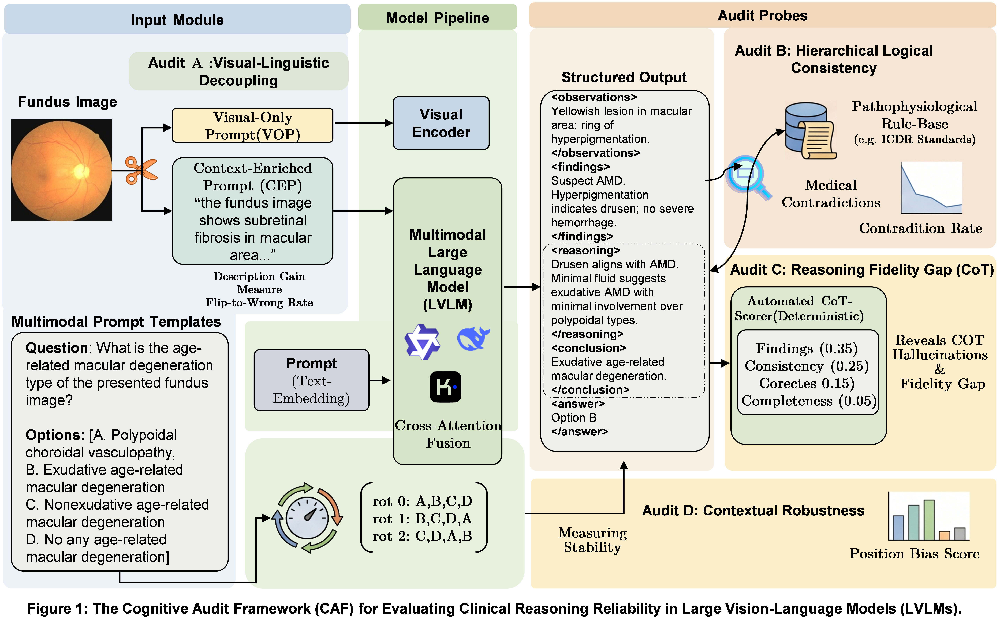

# CAFramework: Consistency-Aware Evaluation for Fundus MLLMs

A consistency-aware evaluation framework built on top of [FunBench](https://huggingface.co/datasets/AIMClab-RUC/FunBench), extending it with multi-dimensional consistency analysis for Multimodal Large Language Models (MLLMs) in fundus image interpretation.

<p align="center">
  
</p>

## Overview

This framework extends FunBench with four consistency evaluation dimensions:

- **L5 — Cross-task Reasoning Consistency**: Detects logical contradictions between L3 lesion recognition and L4 disease diagnosis
- **L6 — Description Dependency**: Evaluates how much models rely on text descriptions (E-mode2 vs E-mode3)
- **L7 — Option Order Robustness**: Tests prediction stability when answer options are shuffled
- **L8 — Hierarchical Consistency**: Evaluates logical consistency across DR grading granularities

## Repository Structure

```
├── evaluate.py              # Original FunBench evaluation entry
├── evaluate_all.py          # Batch evaluation across all tasks
├── evaluate_cot.py          # Chain-of-thought evaluation
├── predict.py               # Prediction script for MLLMs
├── predict_cot.py           # CoT prediction script
├── predict_hf_api.py        # HuggingFace API predictor
├── predict_huatuo_local.py  # Local HuatuoGPT predictor
├── predict_qilin_local_cot.py  # Local Qilin CoT predictor
├── preprocess.py            # Dataset preprocessing
├── preprocess_info.json     # Preprocessing configuration
├── evaluation/              # Evaluation modules (L5–L8)
├── cot_evaluation/          # Chain-of-thought evaluation modules
├── FunBench/                # FunBench benchmark data (L1–L4)
└── requirements.txt
```

## Getting Started

### 1. Install dependencies

```bash
pip install -r requirements.txt
```

### 2. Download FunBench images

FunBench uses 14 public fundus datasets. Download images from the links below and place them under `datasets/`:

- CFP: [`IDRiD`](https://ieee-dataport.org/open-access/indian-diabetic-retinopathy-image-dataset-idrid), [`DDR`](https://github.com/nkicsl/DDR-dataset), [`JSIEC`](https://www.kaggle.com/datasets/linchundan/fundusimage1000), [`RFMiD`](https://riadd.grand-challenge.org/download-all-classes/), [`OIA-ODIR`](https://github.com/nkicsl/OIA-ODIR), [`Retinal-Lesions`](https://github.com/WeiQijie/retinal-lesions)
- OCT: [`OCTDL`](https://data.mendeley.com/datasets/sncdhf53xc/1), [`NEH`](https://data.mendeley.com/datasets/8kt969dhx6/1), [`OCTID`](https://dataverse.scholarsportal.info/dataverse/OCTID), [`UCSD`](https://data.mendeley.com/datasets/rscbjbr9sj/3), [`RETOUCH`](https://retouch.grand-challenge.org/)
- UWF: [`TOP`](https://github.com/DateCazuki/Fundus_Diagnosis)
- Multimodal: [`MMC-AMD`](https://github.com/li-xirong/mmc-amd), [`DeepDRiD`](https://github.com/deepdrdoc/DeepDRiD)

### 3. Preprocess images

```bash
python preprocess.py
```

### 4. Run prediction

```bash
python predict.py
```

### 5. Run evaluation

```bash
python evaluate.py
# or for all tasks:
python evaluate_all.py
```

## Acknowledgements

This work builds upon [FunBench](https://huggingface.co/datasets/AIMClab-RUC/FunBench). We sincerely thank the original authors for their contribution:

```bibtex
@inproceedings{miccai25-funbench,
  title  = {FunBench: Benchmarking Fundus Reading Skills of MLLMs},
  author = {Qijie Wei and Kaiheng Qian and Xirong Li},
  booktitle = {MICCAI},
  year   = {2025}
}
```
