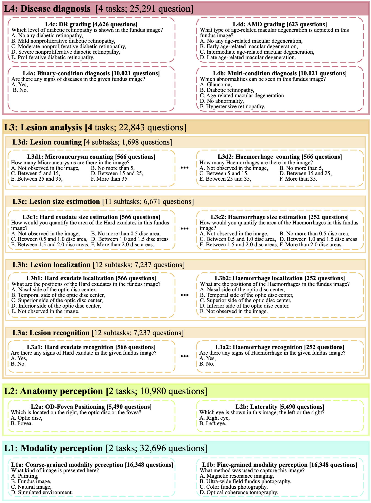
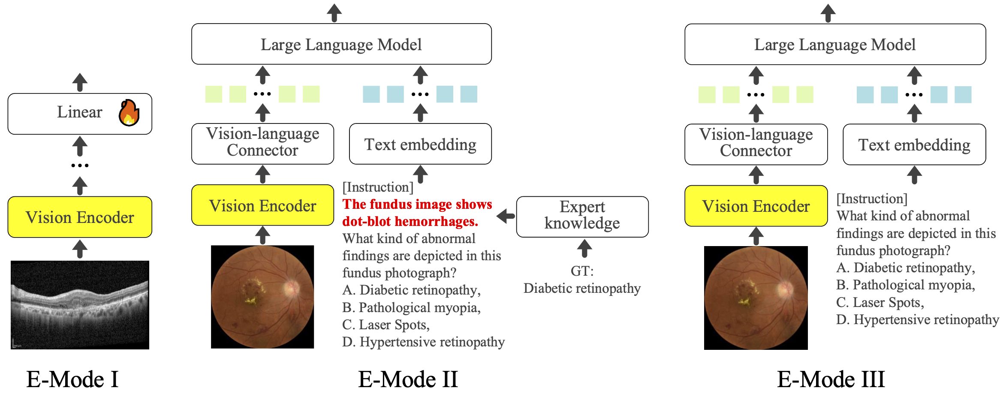
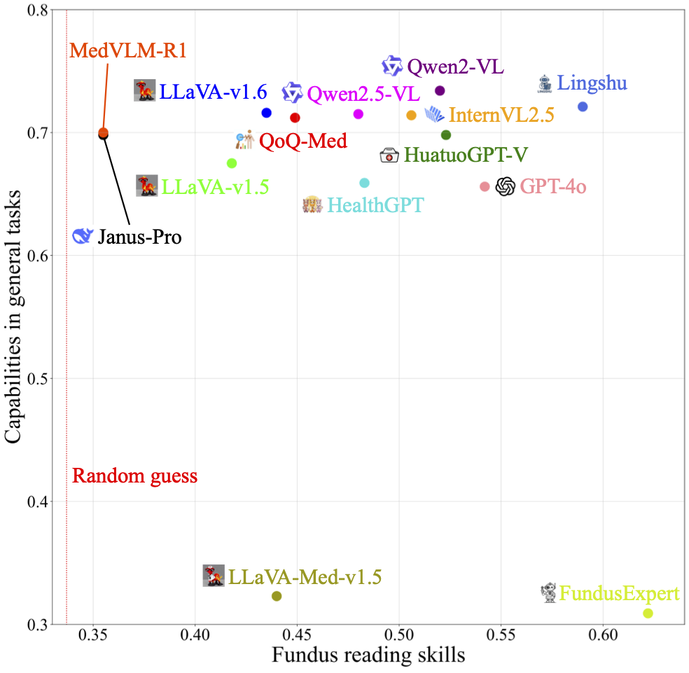
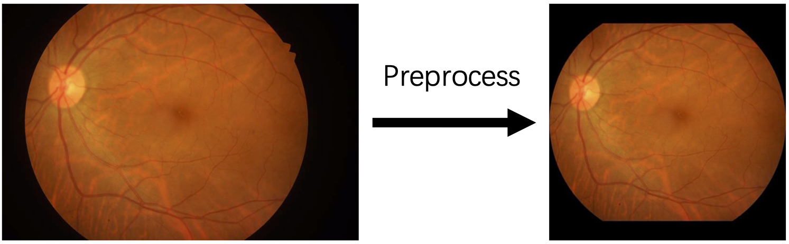

# FunBench: Benchmarking Fundus Reading Skills of MLLMs

<p align="center" style="margin: 20px 0;">
  <!-- Arxiv 按钮 -->
  <a href="https://www.arxiv.org/abs/2503.00901" style="text-decoration: none;">
     
  </a>


## News
+ [2025-12-21] Add more results.
+ [2025-11-06] Add preprocess script for RETOUCH.
+ [2025-05-13] FunBench has been early accepted by MICCAI 2025! 🎉🎉🎉
+ [2025-03-28] FunBench is publicly available on [Hugging Face](https://huggingface.co/datasets/AIMClab-RUC/FunBench)
  

## TODO
- [ ] Automated download script for datasets.


## Introduction

Multimodal Large Language Models (MLLMs) have shown significant potential in medical image analysis. However, their capabilities in interpreting fundus images, a critical skill for ophthalmology, remain under-evaluated. Existing benchmarks lack fine-grained task divisions and fail to provide modular analysis of its two key modules, i.e., large language model (LLM) and vision encoder (VE). This paper introduces FunBench, a novel visual question answering (VQA) benchmark designed to comprehensively evaluate MLLMs’ fundus reading skills. FunBench features a hierarchical task organization across four levels (modality perception, anatomy perception, lesion analysis, and disease diagnosis). It also offers three targeted evaluation modes: linear-probe based VE evaluation, knowledge-prompted LLM evaluation, and holistic evaluation. Experiments on ten open-source MLLMs plus GPT-4o reveal significant deficiencies in fundus reading skills, particularly in basic tasks such as laterality recognition. The results highlight the limitations of current MLLMs and emphasize the need for domain-specific training and improved LLMs and VEs.

## Hierarchical Task Organization
FunBench consists of a total of 10 tasks, divided into 4 levels.
- Level 1 (L1): Modality perception
- Level 2 (L2): Anatomy perception
- Level 3 (L3): Lesion analysis
- Level 4 (L4): Disease diagnosis

 


## Targeted Evaluation Modes
Three targeted evaluation modes (E-mode) are presented.
- E-Mode I: Linear-probe based VE Evaluation
- E-Mode II: Knowledge-prompted LLM evaluation
- E-Mode III: Holistic Evaluation

<div align="center" >
   
</div>


## Results
Results in [TDIUC](https://kushalkafle.com/projects/tdiuc.html) (general field) vs. results in FunBench.

 


## Preparation

### 1. Download FunBench
FunBench is available at [https://huggingface.co/datasets/AIMClab-RUC/FunBench](https://huggingface.co/datasets/AIMClab-RUC/FunBench)

### 2. Download images
We adopt 14 public datasets in FunBench. Please download the images from the provided links and place them in the same directory.
- Six CFP datasets: [`IDRiD`](https://ieee-dataport.org/open-access/indian-diabetic-retinopathy-image-dataset-idrid), [`DDR`](https://github.com/nkicsl/DDR-dataset), [`JSIEC`](https://www.kaggle.com/datasets/linchundan/fundusimage1000), [`RFMiD`](https://riadd.grand-challenge.org/download-all-classes/), [`OIA-ODIR`](https://github.com/nkicsl/OIA-ODIR) and [`Retinal-Lesions`](https://github.com/WeiQijie/retinal-lesions)
- Five OCT datasets: [`OCTDL`](https://data.mendeley.com/datasets/sncdhf53xc/1), [`NEH`](https://data.mendeley.com/datasets/8kt969dhx6/1), [`OCTID`](https://dataverse.scholarsportal.info/dataverse/OCTID), [`UCSD`](https://data.mendeley.com/datasets/rscbjbr9sj/3) and [`RETOUCH`](https://retouch.grand-challenge.org/)
- One UWF dataset: [`TOP`](https://github.com/DateCazuki/Fundus_Diagnosis)
- Two multimodal datasets: [`MMC-AMD`](https://github.com/li-xirong/mmc-amd) and [`DeepDRiD`](https://github.com/deepdrdoc/DeepDRiD)

### 3. Image preprocess
We perform preprocessing `preprocess.py` on RETOUCH dataset and CFP images.

For RETOUCH dataset, it extracts images and masks from the raw data.
For CFP images, it cut out the retina areas and ensure the images are square.
Specifically, some images in `Retinal-Lesions` will be rotated for 180 degrees to ensure consistency between their laterality labels and the image contents.

The preprocessing may take 1-2 hours.

 


## Evaluation

Run `predict.py` to get results from MLLMs and `evaluation.py` to calculate metrics.
The `Predictor` Class in `predict.py` is custom for different MLLMs.


## Citation
If you find this our work useful, please consider citing:

```
@inproceedings{miccai25-funbench,
title = {FunBench: Benchmarking Fundus Reading Skills of MLLMs},
author = {Qijie Wei and Kaiheng Qian and Xirong Li},
booktitle = {MICCAI},
year={2025}
}
```

## Contact
If you encounter any issue, please feel free to reach us either by creating a new issue in the GitHub or by emailing
- Qijie Wei (qijie.wei@ruc.edu.cn)
